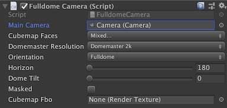

# Fulldome Camera For Unity

Suite of tools for building games for Fulldome.

## Installation

This package can be directly installed as a git package into Unity's package manager:
1. Open Package Manager
2. Click <kbd>+</kbd> and <kbd>Add package from git URL</kbd>
3. Paste ```https://github.com/prefrontalcortex/FulldomeCameraForUnity.git?path=/Packages/FulldomeForUnity```
4. Click <kbd>Add</kbd>

Note that packages are immutable (files can't be changed), copy the samples into your project as necessary.

## Usage

Here there are three approaches that can be used to simulate a fisheye lens on Unity.

1.  **Fulldome Camera**: Renders the active camera as a 360 panorama (internally a Cubemap) and extracts a Domemaster from it.
2.  **VFX Graph** (experimental): No camera tricks, use custom VFX blocks to distort particles around the camera, as  if it was a Fisheye lens
3.  **Shader Graph** (experimental): No camera tricks, use custom Shader Graph nodes to distort mesh vertices around the camera, as  if it was a Fisheye lens

Get inspired and share your works at the [Unity 3D Fulldome Development](https://www.facebook.com/groups/640529606365067/) and [Fulldome Artists United](https://www.facebook.com/groups/FulldomeArtistsUnited/) groups.

There's plenty of information and considerations about the Fulldome format on my [Blendy 360 Cam](http://blendy360cam.com/)'s [manual](http://download.studioavante.com/Blendy360Cam/Blendy360Cam_Manual.pdf).


## Downloads

* **HDRP**, compatible starting from **Unity 2019.2**

	1. Download and import the latest [Release package](https://github.com/rsodre/FulldomeCameraForUnity/releases).
	2. Or... [Clone](https://help.github.com/articles/cloning-a-repository/) or [download](https://github.com/rsodre/FulldomeCameraForUnity/archive/master.zip) this repository and open as a full project in Unity.
	3. Or... For specific Unity versions, checkout by tag:
[2019.2](https://github.com/rsodre/FulldomeCameraForUnity/tree/2019.2)


* **Legacy Standard Renderer**, (not HDRP/URP). Download from the [Releases page](https://github.com/rsodre/FulldomeCameraForUnity/releases) or checkout by tag:
[2019.1](https://github.com/rsodre/FulldomeCameraForUnity/tree/2019.1) /
[2018.3](https://github.com/rsodre/FulldomeCameraForUnity/tree/2018.3) /
[2018.2](https://github.com/rsodre/FulldomeCameraForUnity/tree/2018.2) /
[2018.1](https://github.com/rsodre/FulldomeCameraForUnity/tree/2018.1)

* For **Unity 5.6**, get [FulldomeCameraForUnity5](https://github.com/rsodre/FulldomeCameraForUnity5)


## 1) Fulldome Camera (HDRP)


### How it works

This approach was inspired by [this article](https://blogs.unity3d.com/2018/01/26/stereo-360-image-and-video-capture/), and relies on the `Camera.RenderToCubemap` [method](https://docs.unity3d.com/ScriptReference/Camera.RenderToCubemap.html) first available in Unity 2018.1. It will render your game's camera as a [cubemap](https://en.wikipedia.org/wiki/Cube_mapping) and distort it to a [Domemaster](http://download.studioavante.com/TEMPLATES/DOME/DOME_template_2K.png) format.

If we consider performance and quality, this solution is far from ideal. To make a cubemap, we need to render the scene (up to) 6 times, with 6 different cameras, one for each face of the cube. Rendering a good looking game once is already a challenge, everybody knows, just imagine six. Another problem is that some effects and shaders that depend on the camera position, like reflections, will look weird where the cube faces meet, because neigboring pixels were calculated for different cameras. Front-facing sprites commonly used on particles also will suffer from the same problem.

Ideally, Unity should provide us with a custom camera, that instead of using the usual frustum to raster each frame, would use our custom method that calculate rays from the camera to world, for each pixel. Like Cinema 4D plugins [can do](https://developers.maxon.net/docs/Cinema4DCPPSDK/html/class_video_post_data.html#a597ac521409b00572117ea604536e06f). But there's no way to do it in Unity :(

There's an [issue in Unity Feedback](https://feedback.unity3d.com/suggestions/correct-camera-distortion-issue-on-the-side-by-using-spherical-clipping-planes-instead-of-flat-near-far-clipping-plane) that suggests to solve that problem. The request description don't sound like it, but the solution to the problem is the same (see my comment). Please give some votes.

And here's the Unity [forum thread](https://forum.unity.com/threads/fulldome-camera-for-unity.547939/).


### Usage

This plugin needs just one script to run.

Create one GameObject and add the `FulldomeForUnity/FulldomeCamera/Scripts/FulldomeCamera.cs` to it. Drop the scene's Main Camera to **Main Camera**. The Main Camera Component can now be disabled, since it will be replaced by the final texture.

Configure your fulldome camera on this GameObject...




* **Main Camera**: The camera used to render the cubemap. If null, `Camera.main` will be used.

* **Cubemap Faces**: Depending on your camera orientation and **Horizon** setting, you can turn off some cubemap faces and save several passes. Flat cameras placed on the ground can turn off the **NegativeY**, for example.

* **Orientation**: The point of interest, or sweet spot, on a Fulldome is close to the horizon on the bottom of the frame. On a Fisheye, it's on the center of the frame. This setting will consider this and rotate the main camera to target the correct sweet spot. 

* **DomeMaster Resolution**: Resolution of the generated Domemaster frame, always square.

* **Horizon**: Usually 180 degrees (half sphere).

* **Dome Tilt**: Most planetariums are tilted, giving a more comfortable experience to viewers. Enter the venue tilt here.

* **Masked**: Will ignore and paint black the area outside the fisheye circle. That's 27% less pixels, so please mask.

* **Cubemap Fro**: Optional **Cubemap Render Texture** for the base Cubemap render that will be used to extract the Domemaster. If left empty, the script will automatically create a render texture with the same dimensions as the Domemaster.


### Examples

* **FulldomeCameraHDRP**: Performance is quite bad right now, let's try to find why and help fix it?

* **FulldomeCameraStandard**: Same as previous but using Standard assets. Please not that the SRP Asset must be excluded (Project Settings, Graphics, Scriptable Render Pipeline Settings).

* **FulldomeCameraLegacy**: Uses the original implementation of this approach, using scripts from the `Legacy` folder. It worked exactly the same, but using the Camera component callbacks `OnPreRender` and `OnPostRender` as entry points to generate the Domemaster frame, and was a little bit more complicated to to setup. But was not compatible with Scriptable Render Pipeline. For more details, check the [2019.1](https://github.com/rsodre/FulldomeCameraForUnity/tree/2019.1) README.

### Performance

Since we're rendering 5 to 6 cameras each frame, some care need to be taken about performance. Some post effects will behave weirdly, like reflections and bloom, and since they also affect performance, it's better to disable completely.

Looking at the Frame Debugger, we can pinpoint some choke points, research which effects use them and disable, at the Cameras's **Frame Setting Override** (my preference) or **Project Settings > Quality > HDRP Settings**. Removing these render settings helped a lot to improve performance:

-	Disable Refraction
-	Disable Distortion
-	Disable SSR
-	Disable Post > Depth Of Field
-	Disable Post > Bloom

Also...

-	Disable Lightning & Realtime GI
-	Avoid Visual Environment / Sky / Fog


## 2) VFX Graph

**Work in Progress**, some tests are available at [FulldomeForUnity/Xperiments/VFXGraph](https://github.com/rsodre/FulldomeCameraForUnity/tree/master/Assets/FulldomeForUnity/Xperiments/VFXGraph). 

No camera tricks! Please do not use together with the `FulldomeCamera.cs` script.
 
Use a set of custom VFX blocks to distort particles around the camera, as  if it was a Fisheye lens.
 

## 3) Shader Graph

**Work in Progress**, some tests available at [FulldomeForUnity/Xperiments/ShaderGraph](https://github.com/rsodre/FulldomeCameraForUnity/tree/master/Assets/FulldomeForUnity/Xperiments/VertexShader). 

No camera tricks! Please do not use together with the `FulldomeCamera.cs` script.

Adapt your Shader Graph materials using a custom node to distort mesh vertices around the camera, as  if it was a Fisheye lens.

The [main problem](https://forum.unity.com/threads/position-transformation.657289/) with this approach right now is that the SRP cameras do not have traditional Camera matrices to do the proper transformations. I'm still not sure if it's a bug or it's just how it works.


## Capture

You can render scenes from Unity for your Fulldome movie, of course!

Download [Unity Recorder](https://docs.unity3d.com/Packages/com.unity.recorder@2.0/manual/index.html) from the **Packages Manager**, and export the **Game View**.


## ...And From Unity To The Dome

Fulldome without a Dome is no fun at all!

Here's how I do it.

Game is played on a **Mac** (Mac Pro, MBP Touchbar or even MBP Retina), using a **Syphon** plugin to stream the RenderTexture to [Blendy Dome VJ](http://www.blendydomevj.com/), who takes care of mapping the dome and sending signal to 4 projectors, using a **Datapath FX-4** card.

For a single projector with fisheye lenses, you can just fullscreen and mirror the screen to the projector. Or even better, run windowed, sending the  Fulldome image to another application that can output it to the projector (see below), and you have your monitor free while playing the game.

There are many texture sharing frameworks that can be used to stream texture over applications, using a client-server model.


### Syphon (macOS only)

[Syphon](http://syphon.v002.info/) is the first texture sharing framework to become popular among VJs, supported by all VJ apps.

To create a Syphon server, use [KlakSyphon](https://github.com/keijiro/KlakSyphon). Just add a `SyphonServer` component to your `FulldomeCamera` instance.

Works with Metal API only. Check [here](https://docs.unity3d.com/Manual/Metal.html), Enabling Metal.


### Spout (Windows only)

[Spout](http://spout.zeal.co/) is the equivalent of Syphon on Windows, supported by all VJ apps.

To create a Spout server, use [KlakSpout](https://github.com/keijiro/KlakSpout). Just add a `SpoutSender` component to your `FulldomeCamera` instance.


### NewTek NDI (Windows & macOS)

[NDI](http://ndi.newtek.com/) has the advantage of send textures over a network. It's adoption is growing very fast, and is being used in many TV studios as a clean and cheap capture solution.

To create a NDI server, use [KlakNDI](https://github.com/keijiro/KlakNDI). Just add a `SpoutSender` component to your `FulldomeCamera` instance.

KlakNDI does not work on Metal yet, but a Syphon server can be converted to NDI using [NDISyphon](https://docs.vidvox.net/freebies_ndi_syphon.html), a very nice little tool by [Vidvox](https://github.com/Vidvox).

With this, the game can be played in one computer (Windows or macOS) with a **NDI** server, and another Mac on the network receive with **NDISyphon**, projecting with **Blendy Dome VJ**.


### BlackSyphon (macOS only)

[BlackSyphon](https://docs.vidvox.net/freebies_black_syphon.html), also by [Vidvox](https://github.com/Vidvox), creates a Syphon server from a **Black Magic** capture card.

So the game can be played in fullscreen (Windows or macOS), sending a mirror image to a Black Magic capture on a Mac, reading it with **BlackSyphon**, projecting with **Blendy Dome VJ**.


## Credits

Developed by [Roger Sodré](https://github.com/rsodre) of [Studio Avante](http://www.studioavante.com/) and [United VJs](http://unitedvjs.com.br/).

Many thanks to all these people whose work allowed us to get to this point....

Paul Bourke for his amazing [dome research](http://paulbourke.net/dome/)

[Anton Marini](https://github.com/vade) and [Tom Butterworth](https://github.com/bangnoise) for revolutionizing visuals with [Syphon](https://github.com/Syphon).

[David Lublin](https://github.com/dlublin) of [Vidvox](https://github.com/Vidvox) for all the freebie tools and for the amazing [VDMX](https://vidvox.net/).
